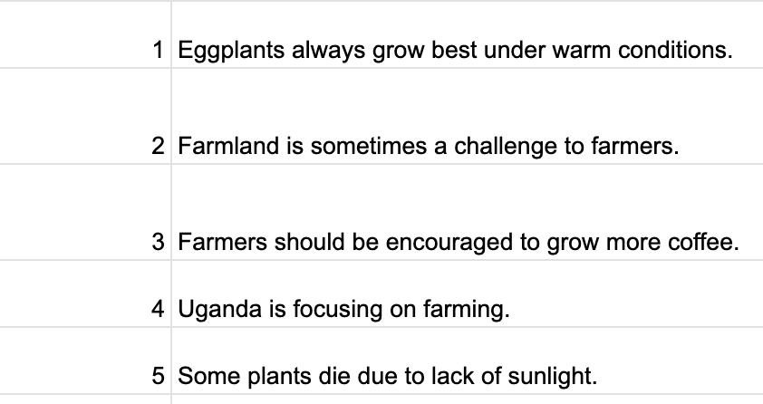

# SALT speech data recording

This is an application for collection of speech data for the purposes of the ASR lab at DSA 2024 Nyeri. It allows you to paste a spreadsheet with an ID and some text to read out. This tool will allow you to read out the text and it will create a wav file for your speech and output a zip with all the audio files and a metadata file with the text corresponding to the audio. To use it:

* Enter the language code for the speech data you want to collect e.g. 'eng'
* Copy IDs and text from spreadsheet and paste them into the tool

* For each text, make a recording by starting and stopping the recording with the tool
* After going through all the text files, you will be able to download the audio files in a zip file
